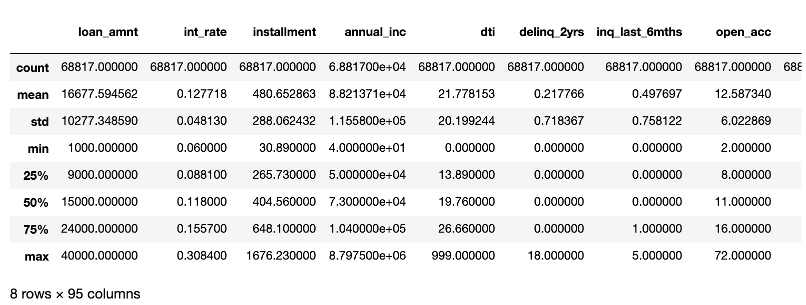
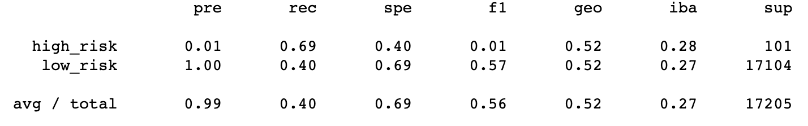
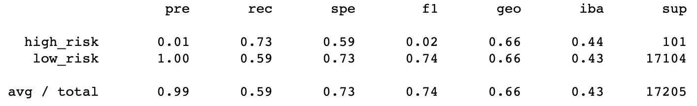
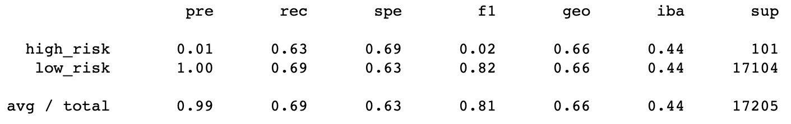
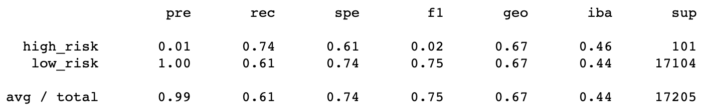
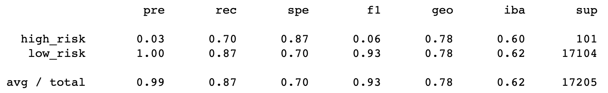
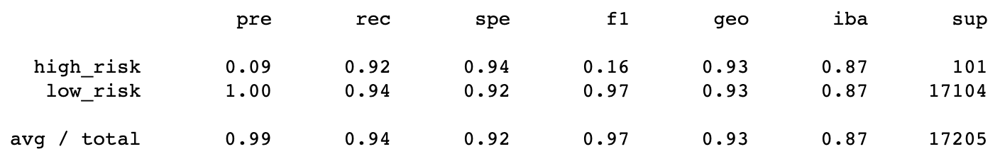

# Credit_Risk_Analysis
Module 17

## Overview of Project
Loans are an essential program for a variety of required and desired items, experiences, education, etc. In this analysis, we can use collected data to predict a credit risk based on a variety of attributes such as the amount of the loan, annual income, interest rate, debt flagging, and much more. This will assist in assessing the risk to maximize the repayment status for a borrower. We will use Machine Supervised Learning since the data attributes and outcome are known and a random forest classifier for our prediction model. 

## Results
The data collected from current loans offer a variety of attributes to train, test, and predict with:
 
<i>Loan Amount, Interest Rate, Installment Payment, Home Ownership Status, Annual Income, Verification Status, Issue Date, Risk Value, Payment Plan Status, Hardship Flag, Debt Settlement Flag, along with moneterary amounts for the loan. </b>

<b>Descriptive statistics regarding the dataframe:</i>

 

 
 

<b><i>The Balanced Accuracy Score</i></b> provides the average of the accuracy per class. Additionally, the <b><i>Precision</i></b> and <b><i>Recall</i></b> returns from the  Confusion Matrix will provide the following analysis: the precision will measure whether the prediction is represented strongly when evaluating the data. The recall will reflect the how well the predication determined the outcome.  

 
 

<li><b>Cluster Centroids Resampler Classification Report, Balanced Accuracy Score = 54%</b></li>

 

<li><b>SMOTEENN Classification Report, Balanced Accuracy Score = 66%</b></li>

 

<li><b>SMOTE Classification Report, Balanced Accuracy Score = 66%</b></li>

 

<li><b>Random Over Sampler Classification Report, Balanced Accuracy Score = 67%</b></li>

 

<li><b>Random Forest Classification Report, Balanced Accuracy Score = 79%</b></li>

 

<li><b>Easy Ensemble Classifier Classification Report, Balanced Accuracy Score = 93%</b></li>

